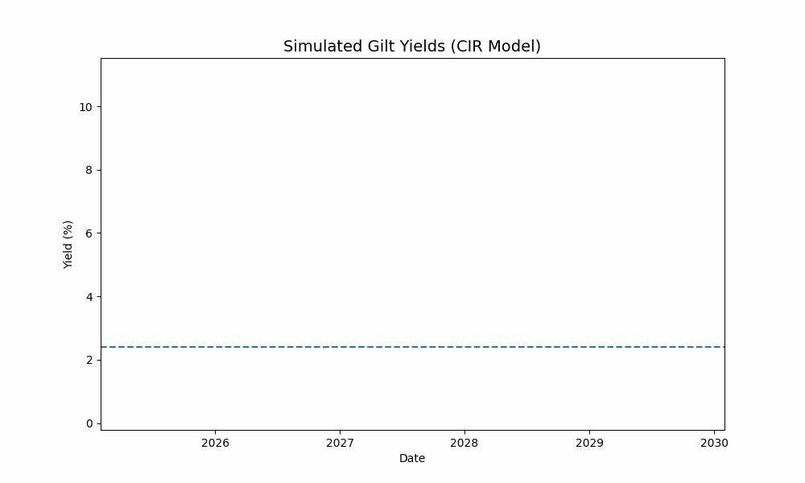

# UK Gilt Modeling with CIR Interest Rate Model

This project models and simulates UK government gilt yields using the Cox-Ingersoll-Ross (CIR) model. It includes parameter calibration, stochastic simulation, and interactive yield visualizations.

## Features

- CIR model implemented in object-oriented Python
- UK DMO data integration
- Interactive Plotly charts
- Model calibration using real historical yields
- Extendable structure for full yield curve modeling

## Interactive Preview



## Getting Started

```bash
git clone https://github.com/yourhandle/uk-gilt-cir-model.git
cd uk-gilt-cir-model
pip install -r requirements.txt
