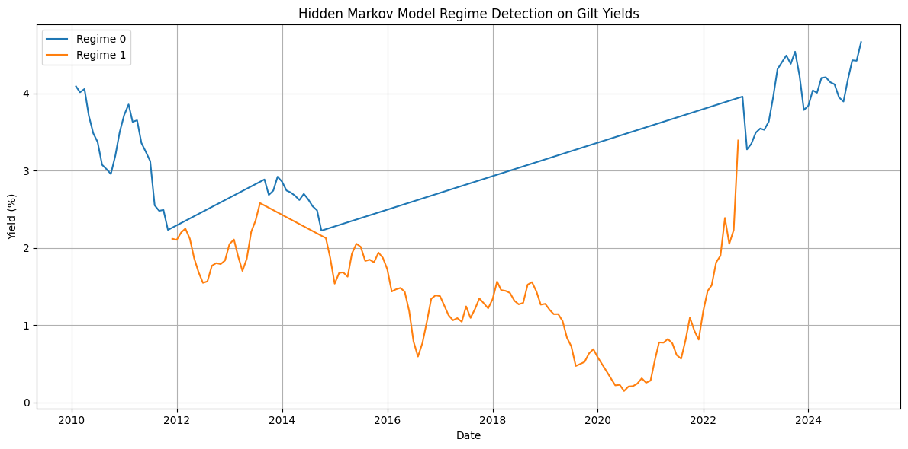

# UK Gilt Modeling with CIR Interest Rate Model

This project models and simulates UK government gilt yields using the Cox-Ingersoll-Ross (CIR) model. It includes parameter calibration, stochastic simulation, and some cool looking plots. All data used is from the official [UK Department of Debt Managment Office.](https://www.dmo.gov.uk/data/ExportReport?reportCode=D4H) 

## Features

- CIR model implemented in Python
- UK DMO data integration
- Interactive Plotly charts
- Model calibration using real historical yields
- Extendable structure for full yield curve modeling

## Interactive Preview

## Cox-Ingersoll-Ross (CIR) Model

The **Cox-Ingersoll-Ross (CIR) model** is a one-factor short rate model used to describe the evolution of interest rates over time. It ensures that the interest rate stays non-negative, making it popular in interest rate modeling.

### Model Dynamics

The CIR model is defined by the following stochastic differential equation (SDE):

$$
dr_t = \kappa (\theta - r_t) \, dt + \sigma \sqrt{r_t} \, dW_t
$$

### Where:
- $r_t$: the instantaneous short rate at time $t$
- $\kappa > 0$: the **mean-reversion speed**
- $\theta > 0$: the **long-term mean level**
- $\sigma > 0$: the **volatility coefficient**
- $W_t$: a standard **Brownian motion**

### Properties:
- **Mean-reverting**: The rate tends to return to $\theta$ over time.
- **Non-negative rates**: Thanks to the square root term $\sqrt{r_t}$, the model avoids negative interest rates if the **Feller condition** is satisfied:

$$
2\kappa\theta \geq \sigma^2
$$

### Applications:
- Modeling the evolution of interest rates
- Pricing zero-coupon bonds
- Valuation of interest rate derivatives

# Quantitative Easing and Quantitative Tightening 

- Built a Hiddent Markov Modle to tak the DMO data and classify it into 2 regiemes inorder to understand if we were in a Quantitative Easing or Quantitative Tightening regime.
- 
- Regime 0 correspons to QT and Regime 1 corresponds to QE

